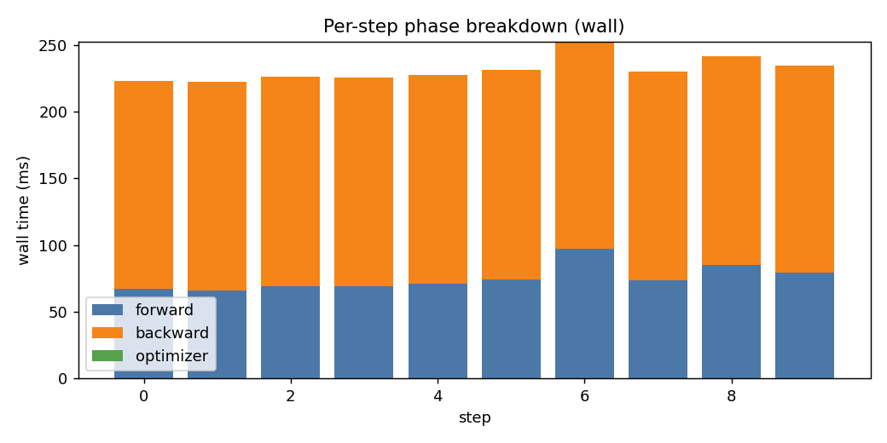
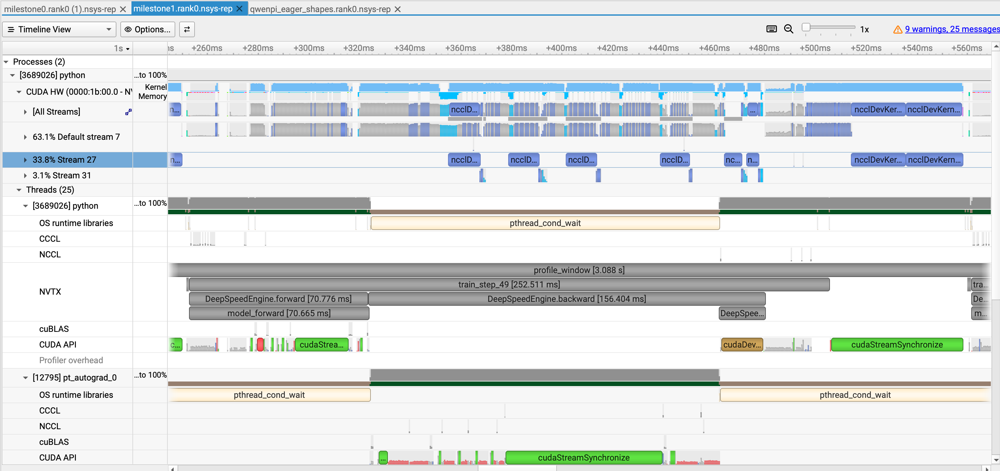
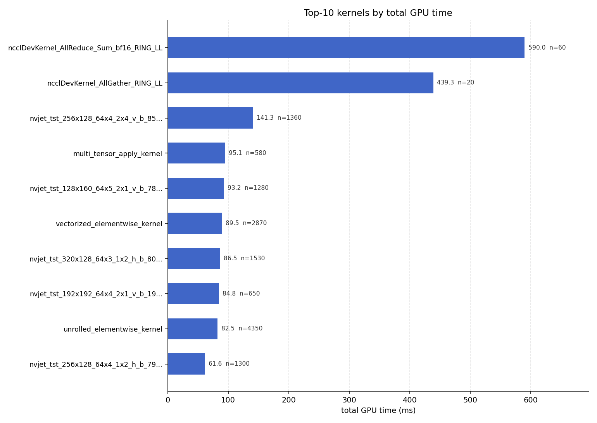
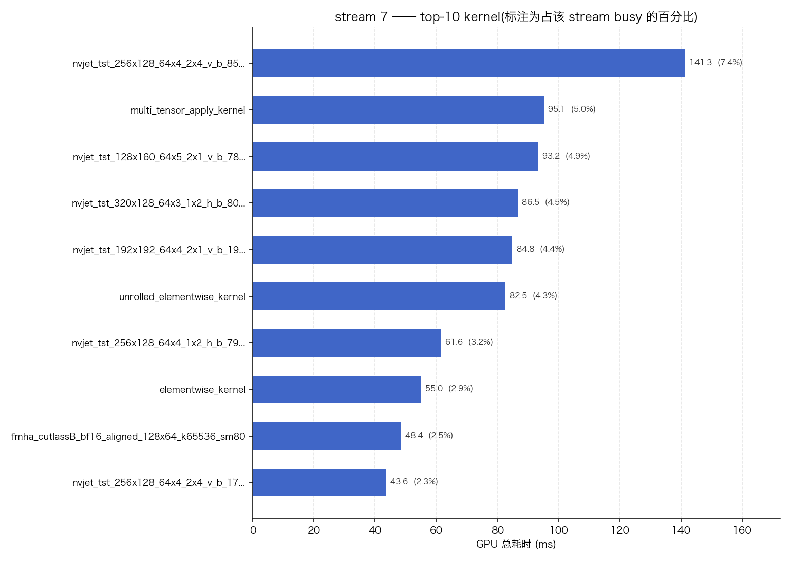

# 训练性能分析报告

## 环境

| 项 | 值 |
|---|---|
| GPU | NVIDIA H200 (matched H200) |
| 精度 / 峰值 | bf16 / 989.5 TFLOP/s dense |
| SM 数 | 132 |
| 参数量(总 / 激活) | 7.52B / None |
| 每步 tokens | None |
| trace 内 phase / module | True / False |

**警告**
- MFU needs num/active params + tokens_per_step in meta JSON -> skipped

## 0. 核心结论(人工总结)

> 综合本报告正文与附录 A/B 的全部取证。注意计时口径:**真实步长(start-to-start)= 314.2 ms/step**,正文的 258.6 ms 是 NVTX step 区间,不含 step 末的参数 AllGather 尾巴。

**总判断:当前瓶颈在流水线编排调度,不在 kernel 本身。** 计算热区已经饱和——backward 期间全流(计算+通信+归约)联合利用率 ~96%,梯度 AllReduce 已打到 NVLink 线速;而每个 step 末端存在一段 ~80 ms(约 25% 步长)的串行区,GPU 计算在此完全空转。可回收的时间几乎全部在"缝"上,不在热区里。

1. **流水线:step 末端的通信无法被掩盖。** ZeRO-2 参数 AllGather 44 ms/step、**100% 暴露**(占真实步长 14%),它发生在 optimizer 更新之后、下一步 forward 之前,结构上没有任何计算可与之并行;加上尾部两桶梯度 AllReduce 的暴露(~12 ms)和 optimizer 串行链(FusedAdamW、fp32↔bf16 回拷、同步),共同构成每步 ~80 ms 的"边界税"。方向:AllGather 异步化藏进下一步 forward(约 −22 ms)、排查 AG2 的 busbw 异常(仅 52% 线速,约 −8 ms)、梯度累积摊薄边界成本。
2. **kernel:算子分布均衡,没有明显的瓶颈算子;占比最高的 GEMM,MFU 已接近实际上限。** GEMM 是计算类 kernel 中时间占比最高的(87.3 ms/step,约占计算 kernel 总时间的一半;占 GPU 全部忙碌 33.6%),加权 MFU 63.1%,而**干净档(不与通信重叠时)普遍 73–79%**——已是 bf16 训练 GEMM 的实用上限水平。其余算子同样没有余量:AR busbw 96–100% 线速,optimizer/elementwise 均在 60–90% HBM 带宽——**没有"坏 kernel",kernel 层面无可压榨空间**。逐形状下钻(附录 B.1.1)还否定了此前的 dgrad 布局猜想:低 MFU 变体是被同期梯度 AllReduce 拖慢 ~1.9–2.1×("重叠税",合计 ~5 ms/step)——本质仍是调度现象,进一步支持总判断。
3. **attention 不是瓶颈。** 当前序列长度太小(VLM 全注意力 S=192、DiT 交叉注意力仅 40 token),fmha 全家每 step 合计 ~7.4 ms(2.4% 步长);其 MFU 虽低(2–8%)但绝对量小,优先级靠后。

同源的一条补充:**每卡负载偏小,系统运行在延迟主导而非吞吐主导的工作点**——8 样本/rank(M=1536)、主 GEMM 单波 120/132 SM,而显存静态占用仅 ~38/141 GB。增大 micro-batch 既摊薄每 token 的边界税、又提升 GEMM 波次利用率,是配置级的高 ROI 选项。

| 优先级 | 动作 | 预期收益 | 性质 |
|---|---|---|---|
| 1 | micro-batch ×2(利用 ~80 GB 显存富余) | 每 token 吞吐 +15~25% | 配置 |
| 2 | AllGather 异步化,藏进下一步 forward | −22 ms/step | 中等工程 |
| 3 | AG2 busbw 异常排查(`NCCL_DEBUG=INFO`) | −8 ms/step | 排查 |
| 4 | 尾桶 AR 暴露 / epilogue sync 收尾 | −5~10 ms/step | 小工程 |
| 5 | 重叠税试验:限制 NCCL 资源抢占(CTA/通道数),减轻 AR 对同期 GEMM 的 ~2× 拖慢 | −3~5 ms/step(可能换损 AR,需 A/B) | 试验 |

开放问题(语义,非性能):compiled run 每步比 eager **真实多执行 ~14 个反传 GEMM**(一个完整"层块",≈1.5 ms/step);eager 的 aten 级全量形状记录中不存在这些调用,不是 kernel 路由差异——建议核对两次 run 的 freeze/激活重计算配置(详见附录 B.1.1 发现 2)。

## 1. 时间线(延迟 / 吞吐 / MFU)

| 指标 | 值 |
|---|---:|
| 平均 step 时间 | 258.6 ms |
| step p50 / p90 / p99 / max | 253.8 / 273.9 / 280.2 / 280.2 ms |
| step 时间 CV | 4.7% |
| GPU 忙(union / wall) | 84.2% |

## 2. 时间层面拆分

第一个问题:GPU 忙不忙、在忙什么?各类别跨 stream 会重叠(comm 可藏在 compute 后),所以不必加起来等于 wall —— `idle` 才是真正的空隙。**看 `comm 暴露` 而不是原始 `comm`**:被 compute 藏住的 comm 在关键路径上代价≈0。

| 类别 | ms | 占 wall % |
|---|---:|---:|
| GPU 忙(union) | 2599.3 | 84.2% |
| — 计算 | 1849.7 | 59.9% |
| — 通信(总) | 1029.5 | 33.3% |
| — 通信(暴露) | 664.2 | 21.5% |
| — 显存 | 155.4 | 5.0% |
| **空闲** | **488.5** | **15.8%** |

**空闲拆分** —— GPU 为什么空转:

| 空闲原因 | ms | 占 idle % | 解法 |
|---|---:|---:|---|
| host wait(CPU 下发太慢) | 458.4 | 85% | CUDA graphs / torch.compile / 更大 batch / 更少 op |
| kernel wait(连续启动开销) | 0.0 | 0% | CUDA graphs |
| other(跨 stream event / 同步) | 82.5 | 15% | 查 CUDA-event 同步、D2H |

**判定: host/sync-bound:阻塞式 synchronize/拷贝拖住了 GPU(标量 .item() 读取?阻塞 H2D/D2H?)**

## 3. Phase 拆分(类 nsys-GUI 视图,隐藏 kernel 细节)

| 阶段 | wall ms | wall % | 阶段内 GPU 利用率 |
|---|---:|---:|---:|
| forward | 751.7 | 24.3% | 62.5% |
| backward | 1561.7 | 50.6% | 80.0% |
| allreduce_gradients | 150.8 | 4.9% | 69.0% |
| dataloader | 9.0 | 0.3% | 0.0% |

## 4. Stream 与 overlap

`exposed`(暴露时间)= 该 stream 对 wall 的边际贡献:其忙碌时间中**未被**其它 stream overlap 的部分。完全被 compute 藏住的 comm stream,即使 busy 很大,exposed 也 ≈ 0 —— 所以原始 GPU 时间不等于延迟代价。

| stream | 主要类别 | busy ms | busy % | exposed ms | exposed % |
|---|---|---:|---:|---:|---:|
| 7 | gemm | 1913.1 | 62.0% | 1475.9 | 47.8% |
| 27 | comm | 1029.5 | 33.3% | 599.9 | 19.4% |
| 31 | elementwise | 93.9 | 3.0% | 86.3 | 2.8% |

## 5. 通信 overlap

- 总通信: 1029.5 ms | 暴露(未被 compute 藏住): **664.2 ms** | overlap 35.5%
  - allreduce: 590.2 ms (80 次)
  - allgather: 439.3 ms (20 次)

## 6. Launch / 气泡分析

**判定: host/sync-bound:阻塞式 synchronize/拷贝拖住了 GPU(标量 .item() 读取?阻塞 H2D/D2H?)**

| 信号 | 值 |
|---|---:|
| GPU 忙 % | 84.2% |
| host-wait 空闲(CPU 下发) | 458.4 ms (14.8% of wall) |
| 最忙 compute stream 上的空隙 | 1316.9 ms (42.6% of wall) |
| 该 stream 平均 kernel 时长 | 27.5 us / 64760 个 kernel |
| host launch 调用数 | 17630 |
| host sync 时间 | 1506.8 ms (48.8% of wall) |

## 7. 按 kernel 类别的耗时

| 类别 | GPU-busy % | total ms | 次数 |
|---|---:|---:|---:|
| comm | 39.6% | 1029.5 | 100 |
| gemm | 33.6% | 873.3 | 17290 |
| elementwise | 14.9% | 386.8 | 25150 |
| other | 12.6% | 326.4 | 13200 |
| memory | 6.0% | 155.5 | 18093 |
| attention | 4.7% | 122.2 | 2960 |
| optimizer | 3.7% | 95.1 | 580 |
| reduction | 1.5% | 38.1 | 5180 |
| norm | 0.4% | 9.8 | 500 |

## 8. Top-10 kernel(按 stream,含关键路径与 MFU)

| kernel | 类 | 阶段 | stream | 次 | avg µs | total ms | 关键路径 ms | GPU % | SM-fill % | waves |
|---|---|---|---|---:|---:|---:|---:|---:|---:|---:|
| `ncclDevKernel_AllReduce_Sum_bf16_RING_LL` | comm | backward | 27 | 60 | 9833.1 | 590.0 | 160.4 | 22.7% | 12% ⚠ | 0.12 |
| `ncclDevKernel_AllGather_RING_LL` | comm | n/a | 27 | 20 | 21964.7 | 439.3 | 439.3 | 16.9% | 18% ⚠ | 0.18 |
| `nvjet_tst_256x128_64x4_2x4_v_b_85...` | gemm | backward | 7 | 1360 | 103.9 | 141.3 | 140.9 | 5.4% | 91% ⚠ | 0.91 |
| `multi_tensor_apply_kernel` | optimizer | backward | 7 | 580 | 164.0 | 95.1 | 95.1 | 3.7% | 100% | 2.11 |
| `nvjet_tst_128x160_64x5_2x1_v_b_78...` | gemm | backward | 7 | 1280 | 72.8 | 93.2 | 93.2 | 3.6% | 100% | 1.00 |
| `vectorized_elementwise_kernel` | elementwise | shared | 31* | 2870 | 31.2 | 89.5 | 87.7 | 3.4% | 100% | 223.64 |
| `nvjet_tst_320x128_64x3_1x2_h_b_80...` | gemm | backward | 7 | 1530 | 56.6 | 86.5 | 86.5 | 3.3% | 100% | 1.00 |
| `nvjet_tst_192x192_64x4_2x1_v_b_19...` | gemm | forward | 7 | 650 | 130.4 | 84.8 | 84.8 | 3.3% | 100% | 1.00 |
| `unrolled_elementwise_kernel` | elementwise | backward | 7* | 4350 | 19.0 | 82.5 | 82.3 | 3.2% | 100% | 77.73 |
| `nvjet_tst_256x128_64x4_1x2_h_b_79...` | gemm | backward | 7 | 1300 | 47.4 | 61.6 | 61.6 | 2.4% | 98% ⚠ | 0.98 |

_`关键路径 ms` = 边际耗时:这个 kernel 实际给 wall 增加了多少(`union(全部) − union(去掉它)`)。`total ms` 高但 `关键路径 ms`≈0 表示它在别的 stream 上被 overlap 了,**不是**延迟优化目标。`stream*` 表示跨多个 stream。_

_每 kernel MFU 用的是该 kernel 所属 module/op 的 MFU(一个 module 的 FLOPs 无法拆到内部各 kernel;若该 module 就是单个 GEMM,则两者相等)。模块归属只覆盖 forward —— backward 的 kernel 模块显示 `–`。真正的每 kernel 实测 FLOPs 需要 ncu。_

## 9. 各 stream 的 top kernel

每条 stream 单独看。comm stream 的头号 kernel 可能 `total ms` 很大,但关键路径 `crit ms`≈0 —— 那条 stream 是被 overlap 的,不是瓶颈。

**stream 7**(gemm)—— busy 1913.1 ms,暴露 1475.9 ms(占 wall 47.8%)

| kernel | 类 | 角色 | 次 | total ms | 占比 % | 关键路径 ms | MFU |
|---|---|---|---:|---:|---:|---:|---:|
| `nvjet_tst_256x128_64x4_2x4_v_b_85...` | gemm | LLM dgrad(MLP/in-proj) | 1360 | 141.3 | 7.4% | 140.9 | 54.8% |
| `multi_tensor_apply_kernel` | optimizer | FusedAdamW 优化器 | 580 | 95.1 | 5.0% | 95.1 | – |
| `nvjet_tst_128x160_64x5_2x1_v_b_78...` | gemm | wgrad(gate/up/down+adaLN) | 1280 | 93.2 | 4.9% | 93.2 | 75.0% |
| `nvjet_tst_320x128_64x3_1x2_h_b_80...` | gemm | wgrad(DiT MLP+in/out-proj) | 1530 | 86.5 | 4.5% | 86.5 | 70.3% |
| `nvjet_tst_192x192_64x4_2x1_v_b_19...` | gemm | fwd(MLP gate+up、LM head) | 650 | 84.8 | 4.4% | 84.8 | 78.6% |
| `unrolled_elementwise_kernel` | elementwise | fp32 分区/逐参数 copy | 4350 | 82.5 | 4.3% | 82.3 | – |
| `nvjet_tst_256x128_64x4_1x2_h_b_79...` | gemm | ViT/连接器 bwd | 1300 | 61.6 | 3.2% | 61.6 | 62.7% |
| `elementwise_kernel` | elementwise | fp32 mul_/strided copy | 2450 | 55.0 | 2.9% | 55.0 | – |
| `fmha_cutlassB_bf16_aligned_128x64_k65536` | attention | VLM 全注意力 bwd | 80 | 48.4 | 2.5% | 48.4 | 2.0% |
| `nvjet_tst_256x128_64x4_2x4_v_b_17...` | gemm | fwd(MLP down、out-proj) | 640 | 43.6 | 2.3% | 43.6 | 77.7% |

_MFU 与"角色"列来自附录 B:形状取自 eager+shapes trace,时间取自本 run(milestone1)实测;非 GEMM 行的带宽/busbw 指标见附录 B.3。_

**stream 27**(comm)—— busy 1029.5 ms,暴露 599.9 ms(占 wall 19.4%)

| kernel | 类 | 角色 | 次 | total ms | 占比 % | 关键路径 ms | MFU |
|---|---|---|---:|---:|---:|---:|---:|
| `ncclDevKernel_AllReduce_Sum_bf16_RING_LL` | comm | 梯度 AllReduce(6 桶/step) | 60 | 590.0 | 57.3% | 160.4 | – |
| `ncclDevKernel_AllGather_RING_LL` | comm | 参数 AllGather(2 组/step) | 20 | 439.3 | 42.7% | 439.3 | – |
| `ncclDevKernel_AllReduce_Sum_f32_RING_LL` | comm | 梯度范数 AllReduce | 20 | 0.2 | 0.0% | – | – |

**stream 31**(elementwise)—— busy 93.9 ms,暴露 86.3 ms(占 wall 2.8%)

| kernel | 类 | 角色 | 次 | total ms | 占比 % | 关键路径 ms | MFU |
|---|---|---|---:|---:|---:|---:|---:|
| `vectorized_elementwise_kernel` | elementwise | 梯度 ×1/8 postscale(bf16) | 2870 | 89.5 | 95.2% | 87.7 | – |

## 10. 自动结论

- host/sync-bound:阻塞式 synchronize/拷贝拖住了 GPU(标量 .item() 读取?阻塞 H2D/D2H?)
- GPU 空闲占 wall 16%;主要是 host-wait(占 idle 85% = 等 CPU 下发),kernel-wait 0%,other 15%
- 通信 overlap 仅 35% -> 暴露 664.2 ms;考虑 prefetch / bucketing / reshard_after_forward=False
- 小 grid kernel(grid < SM 数,填不满 GPU): `ncclDevKernel_AllReduce_Sum_bf`, `ncclDevKernel_AllGather_RING_L`, `nvjet_tst_256x128_64x4_2x4_v_b`, `nvjet_tst_256x128_64x4_1x2_h_b`
- 关键路径最大的 kernel: `ncclDevKernel_AllGather_RING_LL` = 439.3 ms wall -> 延迟优化 ROI 最高

---

## 附录 A. 模型与优化器规模分析(人工取证补充)

> 本附录为人工补写,非 `analyze` 自动生成;**重新运行 report 命令会覆盖本文件,需要重新粘贴此节**。本 run(milestone1)相对基线唯一的配置改动:`reduce_scatter: false`(ZeRO-2 梯度归约改走对 ipg buffer 原地 all_reduce + ×1/8 postscale,消除了每桶 allreduce 前的冗余 flatten cat)。
>
> trace 未携带 meta,参数量从 GPU kernel 尺寸反推,两个独立锚点吻合到 0.02%:锚点 A = FusedAdam `multi_tensor_apply_kernel` block 数(14,354 × chunk 65,536 → 本 rank 分片 9.407e8 元素);锚点 B = step 末 fp32→bf16 参数分片回拷 kernel 的 grid(9.405e8)。另与每 step 6 个梯度 bucket 的元素构成(≈7.47e9)交叉吻合。

### A.1 可训练参数构成(full unfreeze,无 LoRA)

| param group | 模块 | 参数量 | bf16 大小 |
|---|---|---:|---:|
| group 0 | `qwen_vl_interface`(Qwen3.5-4B backbone + vision 接口) | ≈ 4.54e9 | 9.08 GB |
| group 1 | `action_model`(DiT action head) | ≈ 2.99e9 | 5.97 GB |
| **合计** | | **≈ 7.53e9** | **15.05 GB** |

两个 param group 按学习率配置分组(`build_param_lr_groups`);这也是 step 末**恰好 2 次**参数 AllGather 的直接原因(DeepSpeed 对每个 param group 各做一次 `all_gather_into_tensor`,`allgather_bucket_size` 在该代码路径下不生效)。注意:文档标称 "4B" 指 LLM backbone,实测全解冻可训练总量是 **7.53B**。

### A.2 每卡显存静态占用(ZeRO-2,dp=8,bf16 + FusedAdam)

| 组成 | 计算 | 大小/卡 |
|---|---|---:|
| bf16 参数(全量复制,ZeRO-2 不切参数) | 7.53e9 × 2 B | 15.05 GB |
| 梯度 ipg buffer(`contiguous_gradients`,`overlap_comm=true` 双缓冲) | 2 × 1.5e9 × 2 B | 6.00 GB |
| 本 rank 梯度分区(bf16) | 9.41e8 × 2 B | 1.88 GB |
| 优化器态:fp32 master 参数分片 | 9.41e8 × 4 B | 3.76 GB |
| 优化器态:Adam exp_avg 分片 | 9.41e8 × 4 B | 3.76 GB |
| 优化器态:Adam exp_avg_sq 分片 | 9.41e8 × 4 B | 3.76 GB |
| step 期 fp32 梯度分区(瞬时,`flatten` 产物) | 9.41e8 × 4 B | 3.76 GB |
| **小计(不含激活 / NCCL 缓冲 / CUDA graphs 内存池)** | | **≈ 38.0 GB** |

- 优化器态全局总量 = 7.53e9 × 12 B ≈ **90.3 GB**,ZeRO-2 切 8 份后每卡 11.29 GB;若退回 DDP/ZeRO-0,每卡需 ≈ 120 GB,141 GB 的 H200 上加激活风险很大。
- `reduce_scatter: false` 后,基线中每桶 allreduce 前的 ~3 GB 瞬时 flatten 临时张量不再产生(显存峰值略降)。

### A.3 每 step 通信量(rank0 视角,10 step 平均,本 run 实测)

| 通信 | buffer 数据量 | 实测耗时/step | 暴露情况 |
|---|---:|---:|---|
| 梯度 AllReduce(bf16,6 buckets,RING_LL,ipg 原地) | 15.05 GB | 59.0 ms | 大部分被 backward 掩盖,关键路径贡献 ≈ 16.0 ms |
| 梯度范数 AllReduce(f32,2 次) | ~KB 级 | 0.02 ms | 可忽略 |
| 参数 AllGather(bf16,2 个 param group,RING_LL) | 15.05 GB | 43.9 ms | **100% 暴露**(占真实步长 ~14%) |

注意:NVTX `step` 区间(均值 258.6 ms)不含参数 AllGather 尾巴,**真实 start-to-start 步长 ≈ 314.2 ms**,评估吞吐/MFU 请用后者。

### A.4 MFU 补算公式

有了 N = 7.53e9,MFU 只差每卡每步 token 数 d(用真实步长 0.3142 s):

MFU = 6 × 7.53e9 × d / (0.3142 s × 989.5e12) ≈ **d × 1.45e-4**,即 d ≈ 2,750 tokens/卡/step 时 MFU = 40%。

`run_meta.json` 已在本目录(含 `num_params`),拿到 d 后填入 `tokens_per_step` 重跑 analyze+report 即可自动出 MFU(若训练开了 activation checkpointing,再把 `recompute` 置 true)。

---

## 附录 B. 每 kernel 真实 MFU(基于 eager+shapes trace 的形状取证)

> 方法:用 `qwenpi_eager_shapes.rank0.sqlite`(`emit_nvtx(record_shapes=True)` 的 eager run,同样 10 步)提取每个 GEMM/attention 算子的输入形状 → 按形状算 FLOPs;**时间一律用本报告(milestone1,compiled 生产 run)的实测值**。eager→m1 的 kernel 变体匹配依据三重指纹:tile 前缀 + step 内位置(forward/backward 互斥,100% 分离)+ 实例数/grid 直方图(逐 bin 一致);17,020 个 nvjet kernel 与 aten NVTX 关联成功率 100%。stream 7 表格中的 MFU 列即来自本附录。

### B.1 六大 GEMM 变体 MFU(峰值 989.5 TFLOP/s)

| m1 kernel | 角色 | 次/step | ms/step | FLOPs/step | 实测 TFLOP/s | **MFU** |
|---|---|---:|---:|---:|---:|---:|
| `nvjet_..._2x4_v_b_85` | LLM dgrad(MLP/in-proj) | 136 | 14.13 | 7.66e12* | 542 | **54.8%** |
| `nvjet_..._2x1_v_b_78` | wgrad(gate/up/down + adaLN) | 128 | 9.32 | 6.99e12* | 742 | **75.0%** |
| `nvjet_..._1x2_h_b_80` | wgrad(DiT MLP + in/out-proj) | 153 | 8.65 | 6.02e12* | 695 | **70.3%** |
| `nvjet_..._2x1_v_b_19` | fwd(MLP gate+up、LM head) | 65 | 8.48 | 6.59e12 | 778 | **78.6%** |
| `nvjet_..._1x2_h_b_79` | bwd(ViT MLP/QKV、连接器) | 130 | 6.16 | 3.82e12 | 620 | **62.7%** |
| `nvjet_..._2x4_v_b_17` | fwd(MLP down、out-proj) | 64 | 4.36 | 3.35e12 | 769 | **77.7%** |

\* m1 实例数比 eager 多 0–3.8%。B.1.1 下钻确认:这**不是** heuristic 路由差异,而是 compiled run 每步真实多执行的反传 GEMM(见 B.1.1 发现 2);其形状已被逐一识别并计入下表,故本表 FLOPs 按 m1 实际次数计。

**六变体合计 67.9%;全部 GEMM 加权总 MFU = 5.456e13 FLOPs/step ÷ 87.33 ms/step ÷ 989.5e12 = 63.1%**(长尾小 GEMM 拉低)。

#### B.1.1 MFU 计算明细(逐形状,含每形状实测时间)

公式:`FLOPs/次 = 2·M·N·K`;**`MFU = FLOPs/次 ÷ 时间/次 ÷ 989.5e12`**。形状来自 eager trace;**每形状的 m1 时间由逐实例分配获得**:实例数精确相等的变体用位置法(step 内第 i 次出现逐位对齐,eager 形状序列 10 步完全一致;`_79` 另经逐位 grid 验证 130/130 全对),计数不等的变体用块结构解析(解析器在 eager 全量标签上自校验 131/131);纯时长聚类只作交叉验证(在被 NCCL 重叠减速污染的变体上会失效)。**守恒校验:每变体 Σ(形状 ms/step) 与该变体总时长误差 0.0000%;同 (M,N) 下时长随 K 严格单调。**

**`nvjet_..._2x4_v_b_85`**(m1 136 次/step,合计 14.128 ms/step)—— LLM dgrad

| M×N×K | 归属 | 次/step | GFLOPs/次 | µs/次 | ms/step | TFLOP/s | MFU |
|---|---|---:|---:|---:|---:|---:|---:|
| 1536×2560×9216 | MLP gate/up dgrad | 64 | 72.5 | 134.8 | 8.626 | 538 | 54.3% |
| 1536×2560×8192 | in-proj dgrad | 32 | 64.4 | 116.2 | 3.719 | 554 | 56.0% |
| 1536×2560×4096 | out-proj dgrad | 24 | 32.2 | 59.0 | 1.416 | 546 | 55.2% |
| 1536×2560×1024 | (GQA/gated-delta 分支) | 16 | 8.1 | 22.9 | 0.367 | 351 | 35.5% |

注:该变体 ~45% 的实例与梯度 AllReduce 时间重叠、被拖慢 1.9–2.1×(K=9216 档:干净实例 ~93 µs ≈ 78% MFU,减速实例 ~180 µs)——聚合 54–56% **全部由重叠造成,与转置布局无关**。

**`nvjet_..._2x1_v_b_78`**(m1 128 次/step,合计 9.322 ms/step)—— wgrad

| M×N×K | 归属 | 次/step | GFLOPs/次 | µs/次 | ms/step | TFLOP/s | MFU |
|---|---|---:|---:|---:|---:|---:|---:|
| 9216×2560×1536 | MLP gate/up wgrad | 64 | 72.5 | 93.7 | 6.000 | 773 | 78.1% |
| 2560×9216×1536 | MLP down wgrad | 32 | 72.5 | 93.2 | 2.983 | 777 | 78.6% |
| 5120×2560×16 | DiT adaLN wgrad(K=16!) | 32 | 0.4 | 10.6 | 0.339 | 40 | 4.0% |

**`nvjet_..._1x2_h_b_80`**(m1 153 次/step,合计 8.653 ms/step)—— wgrad(DiT+LLM)

| M×N×K | 归属 | 次/step | GFLOPs/次 | µs/次 | ms/step | TFLOP/s | MFU |
|---|---|---:|---:|---:|---:|---:|---:|
| 8192×2560×1536 | in-proj wgrad | 32 | 64.4 | 86.6 | 2.770 | 744 | 75.2% |
| 2560×4096×1536 + 4096×2560×1536(同 FLOPs,合并) | out-proj 族 wgrad | 56 | 32.2 | 44.6 | 2.499 | 722 | 72.9% |
| 2560×10240×640 | DiT MLP down wgrad | 32 | 33.6 | 51.9 | 1.659 | 647 | 65.4% |
| 10240×2560×640 | DiT MLP up wgrad | 32 | 33.6 | 51.7 | 1.654 | 649 | 65.6% |
| 2560×4096×1024 | (ViT 边界) | 1 | 21.5 | 70.4 | 0.070 | 305 | 30.8% |

**`nvjet_..._2x1_v_b_19`**(m1 65 次/step,合计 8.479 ms/step)—— fwd

| M×N×K | 归属 | 次/step | GFLOPs/次 | µs/次 | ms/step | TFLOP/s | MFU |
|---|---|---:|---:|---:|---:|---:|---:|
| 1536×9216×2560 | MLP gate+up fwd | 64 | 72.5 | 93.4 | 5.978 | 776 | 78.4% |
| 1536×248320×2560 | LM head logits | 1 | 1952.9 | 2501.1 | 2.501 | 781 | 78.9% |

**`nvjet_..._1x2_h_b_79`**(m1 130 次/step,合计 6.159 ms/step)—— ViT/连接器 bwd

| M×N×K | 归属 | 次/step | GFLOPs/次 | µs/次 | ms/step | TFLOP/s | MFU |
|---|---|---:|---:|---:|---:|---:|---:|
| 3072×2560×2560 | LLM→DiT 连接器 dgrad | 32 | 40.3 | 53.6 | 1.714 | 752 | 76.0% |
| 4096×4096×1024 | ViT MLP bwd | 24 | 34.4 | 58.1 | 1.394 | 592 | 59.8% |
| 4096×1024×4096 | ViT MLP bwd | 24 | 34.4 | 57.2 | 1.373 | 601 | 60.7% |
| 4096×1024×3072 | ViT QKV bwd | 24 | 25.8 | 44.3 | 1.062 | 582 | 58.9% |
| 4096×1024×1024 | ViT bwd | 24 | 8.6 | 18.7 | 0.448 | 460 | 46.5% |
| 1024×4096×4096 | (ViT patch 边界) | 1 | 34.4 | 102.8 | 0.103 | 334 | 33.8% |
| 1024×4096×2560 | (同上) | 1 | 21.5 | 64.4 | 0.064 | 334 | 33.7% |

**`nvjet_..._2x4_v_b_17`**(m1 64 次/step,合计 4.359 ms/step)—— fwd

| M×N×K | 归属 | 次/step | GFLOPs/次 | µs/次 | ms/step | TFLOP/s | MFU |
|---|---|---:|---:|---:|---:|---:|---:|
| 1536×2560×9216 | MLP down fwd | 32 | 72.5 | 92.8 | 2.971 | 781 | 78.9% |
| 1536×2560×4096 | out-proj fwd | 32 | 32.2 | 43.4 | 1.388 | 742 | 75.0% |

**发现 1(修正 B.2 旧结论):"dgrad 转置布局差"不成立,真凶是重叠税。** 全体干净档 GEMM 普遍 **73–79% MFU**(dgrad 干净实例与同形状 forward 等效);拉低聚合值的是与梯度 AllReduce 重叠的减速档(~1.9–2.1×,`_85` 约 45% 实例、`_79` 的 ViT 段亦然)。按干净档速率折算,这 6 个变体上的重叠税 ≈ **5 ms/step**——AR"被计算藏住"并非免费,它对同期计算征收 ~2× 的资源税。真正形状意义上的低效只有小 K(adaLN K=16 → 4.0%、ViT 窄维 46–61%),绝对量都很小。

**发现 2(开放问题):compiled run 每步比 eager 真实多执行 ~14 个反传 GEMM。** `_85` +5/step(一个位于序列最前的 [K9216×2, K1024×2, K8192×1] 块)、`_78` +3、`_80` +2、其余家族 +4。eager 的 aten 级全量形状记录(record_shapes ground truth)中不存在这些调用——**不是 kernel 路由差异,是 compiled run 真实多算了约一个"层块"的反传**(≈1.5 ms/step)。疑两次 run 的 freeze/激活重计算(rematerialization)配置不一致,建议核对;对性能影响小,但关系到两次 run 语义是否一致。

逐实例分配数据:session scratchpad 的 `per_shape_mfu.json`(每变体逐 ordinal 的形状、方法、grid、10 步原始时长)+ `extract_instances.py`/`per_shape.py`。

### B.2 形状层面的发现

- 模型执行画像(由形状反推):micro-batch = **8 样本/rank**(~192 token/样本,合计 M=1536);LLM 32 层(hidden 2560,MLP I=9216,gate/up 分开)、ViT 24 层(hidden 1024)、DiT 32 层(hidden 2560,MLP 10240,DiT token 640 = 40×2 reps×8 样本);LM head(vocab≈248k)只有 forward,无对应反向 GEMM(与 embedding/lm_head 不在 7.53B 可训练参数中一致)。
- **[已修正,见 B.1.1 发现 1]** ~~dgrad 转置布局是效率洼地~~——逐形状下钻显示 dgrad 干净实例与 forward 等效(~78%),聚合 54.8% 由与梯度 AllReduce 的重叠减速(~2×)造成;"重叠税"合计 ~5 ms/step,是调度现象而非 kernel 问题。
- 次低是窄维 ViT/连接器反向(`_79`,N/K≤1024)和小 K wgrad(DiT adaLN 的 K=16、DiT token 的 K=640)。
- M=1536 时主 GEMM 单波 120/132 SM;增大 micro-batch token 数可吃满整卡。
- fwd:bwd GEMM 次数 = 579:1138/step ≈ 1:2,形状账目自洽。

### B.3 非 GEMM top kernel:按瓶颈类型给指标

| kernel | 时间/step | 合适的指标 | 定性 |
|---|---:|---|---|
| `fmha_cutlassB_...k65536`(VLM 全注意力 bwd ×8;q=[8,192,16,256] 带 bias) | 4.84 ms | **MFU 2.0%**(净 3.0%) | Dh=256 的 sm80 cutlass bwd 效率差 + S=192 太短;绝对量小 |
| `fmha_cutlassF`(VLM fwd ×8)/ DiT cross-attn(×32) | 1.06/2.09 ms | MFU 8.5% / 3.4% | 形状太小,compute-bound |
| `multi_tensor_apply`(实为 torch `_fused_adamw_` ×46 + 杂项) | 9.51 ms | **2865 GB/s = 60% HBM** | memory-bound,MFU 不适用 |
| `vectorized_elementwise`(主体 = 梯度 ×1/8 postscale,bf16,7.5e9 元素) | 8.95 ms | postscale **4106 GB/s = 86% HBM** | memory-bound,已很高效 |
| `unrolled_elementwise`(fp32 分区 copy + 逐参数小 copy) | 8.25 ms | 大 copy 2.8 TB/s;小 copy ~0.8 TB/s | 小 copy 属 launch-bound |
| `elementwise_kernel`(fp32 mul_ + ViT strided copy) | 5.50 ms | 2.9 TB/s / 0.65 TB/s(strided 14%) | memory-bound |
| `ncclAllReduce bf16` ×6 | 59.0 ms | **busbw 431–451 GB/s ≈ 96–100% NVLink 线速** | b1–b4 大部被掩盖,b5/b6 ~12 ms 暴露 |
| `ncclAllGather` ×2 | 43.9 ms | busbw **364(81%)/ 236(52%)** GB/s | 完全暴露;AG2 明显低效 |

### B.4 对优化路线图的修正

1. **梯度 AllReduce 的协议调优可以划掉**:实测 busbw 已打到 NVLink 线速(96–100%),RING_LL 在这个尺寸上没有留钱。
2. AllGather 仍是第一目标,且细化为两部分:**结构性暴露 44 ms(靠异步化藏进下一步 forward,~22 ms)** + **AG2 的带宽异常(52% busbw,比 AG1 少 34% 数据却同耗时,疑 NCCL channel/协议选择,~8 ms)**。
3. **[修正]** ~~dgrad 布局调优~~——干净档 GEMM 已 73–79%,接近上限;替代单点:重叠税试验(限制 NCCL CTA/通道数以减轻 AR 对同期 GEMM 的 ~2× 拖慢,≈5 ms 池子,可能换损 AR 需 A/B)、gate+up 融合(减半 64 次/step 小 GEMM)、增大 micro-batch(单波 120/132 SM 吃满)。
4. 非 GEMM 没有"坏 kernel":optimizer/elementwise 都在 60–90% HBM;VLM attention bwd 的 2% MFU 刺眼但绝对量只有 4.8 ms。
5. **开放问题**:compiled run 每步比 eager 多 ~14 个反传 GEMM(整"层块",+1.5 ms/step,真实多算而非路由差异)——核对 freeze/激活重计算配置(B.1.1 发现 2)。

误差源:变体匹配的 2–4% 实例数差(已用双口径界定 ≤2pp)、FLOPs=2MNK 不含 epilogue、峰值未扣降频、每变体多形状混合(变体级加权平均)。中间数据与脚本:session scratchpad 的 `gemm_mfu*.py/json`。
